# Introduction to this template

This is a template which can be used to create an automated outbreak situation
report for cholera. 

- It is organised by time, place and person. 
For a more detailed explanation of this template, please visit https://r4epis.netlify.com/outbreaks
- Feedback and suggestions are welcome at the [GitHub issues page](https://github.com/R4EPI/sitrep/issues)
- Text within <! > will not show in your final document. These comments are used
to explain the template. You can delete them if you want.

<!-- ~~~~~~~~~~~~~~~~~~~~~~~~~~~~~~~~~~~~~~~~~~~~~~~~~~~~~~~~~~~~~~~~~~~~~~~~~~~
This comment will not show up when you knit the document.

A comment with a title with slashes indicates a name of a code chunk.
~~~~~~~~~~~~~~~~~~~~~~~~~~~~~~~~~~~~~~~~~~~~~~~~~~~~~~~~~~~~~~~~~~~~~~~~~~~~ -->


## Installing and loading required packages 
<!-- ~~~~~~~~~~~~~~~~~~~~~~~~~~~~~~~~~~~~~~~~~~~~~~~~~~~~~~~~~~~~~~~~~~~~~~~~~~~
/// setup \\\
--------------------------------------------------------------------------------

Several packages are required for different aspects of  analysis with *R*. 
You will need to install these before starting. 

These packages can be quite large and may take a while to download in the
field. If you have access to a USB key with these packages, it makes sense to
copy and paste the packages into your computer's R package library 
(run the command .libPaths() to see the folder path). 

For help installing packages, please visit https://r4epis.netlify.com/welcome
~~~~~~~~~~~~~~~~~~~~~~~~~~~~~~~~~~~~~~~~~~~~~~~~~~~~~~~~~~~~~~~~~~~~~~~~~~~~ -->


<!-- ~~~~~~~~~~~~~~~~~~~~~~~~~~~~~~~~~~~~~~~~~~~~~~~~~~~~~~~~~~~~~~~~~~~~~~~~~~~
/// define_current_week \\\
--------------------------------------------------------------------------------

You need to set the week you want to report on. Generally, this is the previous
week. Put it below.

aweek::set_week_start will define the beginning of the week. The standard is
Monday.
~~~~~~~~~~~~~~~~~~~~~~~~~~~~~~~~~~~~~~~~~~~~~~~~~~~~~~~~~~~~~~~~~~~~~~~~~~~~ -->


<!-- ~~~~~~~~~~~~~~~~~~~~~~~~~~~~~~~~~~~~~~~~~~~~~~~~~~~~~~~~~~~~~~~~~~~~~~~~~~~
/// read_fake_data \\\
--------------------------------------------------------------------------------


To play with this template, you can create fake data. Comment out this chunk
when you are using real data.
~~~~~~~~~~~~~~~~~~~~~~~~~~~~~~~~~~~~~~~~~~~~~~~~~~~~~~~~~~~~~~~~~~~~~~~~~~~~ -->


<!-- ~~~~~~~~~~~~~~~~~~~~~~~~~~~~~~~~~~~~~~~~~~~~~~~~~~~~~~~~~~~~~~~~~~~~~~~~~~~
You should load your data as a linelist, where each row is one case.

There are two options:
- Your data is from DHIS2: use read_DHIS_excel_data
- Your data is NOT FROM DHIS2 and in Excel, CSV, or Stata format: 
use read_nonDHIS_data
~~~~~~~~~~~~~~~~~~~~~~~~~~~~~~~~~~~~~~~~~~~~~~~~~~~~~~~~~~~~~~~~~~~~~~~~~~~~ -->

<!-- ~~~~~~~~~~~~~~~~~~~~~~~~~~~~~~~~~~~~~~~~~~~~~~~~~~~~~~~~~~~~~~~~~~~~~~~~~~~
/// read_DHIS_data \\\
--------------------------------------------------------------------------------

This section is for data from DHIS2.
It uses the standardized MSF data dictionary.
If you didn't use the standardized data dictionary, go to read_nonDHIS_data.
~~~~~~~~~~~~~~~~~~~~~~~~~~~~~~~~~~~~~~~~~~~~~~~~~~~~~~~~~~~~~~~~~~~~~~~~~~~~ -->


<!-- ~~~~~~~~~~~~~~~~~~~~~~~~~~~~~~~~~~~~~~~~~~~~~~~~~~~~~~~~~~~~~~~~~~~~~~~~~~~
/// prep_DHIS_data \\\
--------------------------------------------------------------------------------

This section is for data from DHIS2 that you loaded in read_DHIS_data.

If you didn't use DHIS2 data, go to read_nonDHIS_data.

This step shows you the data dictionary. The data dictionary has variable names
in the data_element_shortname column. Possible values for each variable are
specified in code and name columns. Code has the shortened value and Name has
the full-text value.
~~~~~~~~~~~~~~~~~~~~~~~~~~~~~~~~~~~~~~~~~~~~~~~~~~~~~~~~~~~~~~~~~~~~~~~~~~~~ -->


<!-- ~~~~~~~~~~~~~~~~~~~~~~~~~~~~~~~~~~~~~~~~~~~~~~~~~~~~~~~~~~~~~~~~~~~~~~~~~~~
/// read_nonDHIS_data \\\
--------------------------------------------------------------------------------

This section is for data not from DHIS2.
If you have already loaded data from DHIS2, go to read_population_data.
~~~~~~~~~~~~~~~~~~~~~~~~~~~~~~~~~~~~~~~~~~~~~~~~~~~~~~~~~~~~~~~~~~~~~~~~~~~~ -->


<!-- ~~~~~~~~~~~~~~~~~~~~~~~~~~~~~~~~~~~~~~~~~~~~~~~~~~~~~~~~~~~~~~~~~~~~~~~~~~~
/// prep_nonDHIS_data \\\
--------------------------------------------------------------------------------

This section is for data not from DHIS2. 
If you have already loaded data from DHIS2, go to read_population_data.

It is more difficult to prepare the nonDHIS data. You can do it! It will just
take a little more work.

Checklist to update this script to match your data:
[ ] Comment out all lines in read_DHIS_data and prep_DHIS_data
[ ] Recode your variable names to match the dictionary
[ ] Recode variable contents to match the dictionary


This step shows you the data dictionary. The data dictionary has variable names
in the data_element_shortname column. Possible values for each variable are
specified in code and name columns. Code has the shortened value and Name has
the full-text value.
~~~~~~~~~~~~~~~~~~~~~~~~~~~~~~~~~~~~~~~~~~~~~~~~~~~~~~~~~~~~~~~~~~~~~~~~~~~~ -->


<!-- ~~~~~~~~~~~~~~~~~~~~~~~~~~~~~~~~~~~~~~~~~~~~~~~~~~~~~~~~~~~~~~~~~~~~~~~~~~~
/// read_population_data \\\
--------------------------------------------------------------------------------

This template uses population data to calculate things like incidence.

There are three options:
- You can read in a spreadsheet with age group and region data.
- You can put in the specific populations into the gen_population function. 
- If you have the total or regional populations, you can estimate the age group
from proportions.

Comment out the options you are not using.


Age group proportions are from the OCBA population denominators tool v1. The
proportions below are for sub-Saharan Africa in 2019. They are only an estimate!
If you have more specific proportions, you can use them below.
~~~~~~~~~~~~~~~~~~~~~~~~~~~~~~~~~~~~~~~~~~~~~~~~~~~~~~~~~~~~~~~~~~~~~~~~~~~~ -->


<!-- ~~~~~~~~~~~~~~~~~~~~~~~~~~~~~~~~~~~~~~~~~~~~~~~~~~~~~~~~~~~~~~~~~~~~~~~~~~~
/// lab_data \\\
--------------------------------------------------------------------------------

If you have lab data, you can read it in here.
You will need to make sure that your identifier (e.g. case_number) matches the
linelist.
~~~~~~~~~~~~~~~~~~~~~~~~~~~~~~~~~~~~~~~~~~~~~~~~~~~~~~~~~~~~~~~~~~~~~~~~~~~~ -->


<!-- ~~~~~~~~~~~~~~~~~~~~~~~~~~~~~~~~~~~~~~~~~~~~~~~~~~~~~~~~~~~~~~~~~~~~~~~~~~~
/// browse_data \\\
--------------------------------------------------------------------------------

You'll want to look at your data. Here are a few ways you can explore.
~~~~~~~~~~~~~~~~~~~~~~~~~~~~~~~~~~~~~~~~~~~~~~~~~~~~~~~~~~~~~~~~~~~~~~~~~~~~ -->


<!-- ~~~~~~~~~~~~~~~~~~~~~~~~~~~~~~~~~~~~~~~~~~~~~~~~~~~~~~~~~~~~~~~~~~~~~~~~~~~
/// remove_unused_data \\\
--------------------------------------------------------------------------------

Your data might have empty rows or columns you want to remove.
You can also use this section to create temporary datasets so you can review
specific variables or rows.
~~~~~~~~~~~~~~~~~~~~~~~~~~~~~~~~~~~~~~~~~~~~~~~~~~~~~~~~~~~~~~~~~~~~~~~~~~~~ -->


<!-- ~~~~~~~~~~~~~~~~~~~~~~~~~~~~~~~~~~~~~~~~~~~~~~~~~~~~~~~~~~~~~~~~~~~~~~~~~~~
This part of the script will create and clean variables in your data.

All your cleaning and variable creation should happen in these chunks.
That way, in case something goes wrong, you can push the small arrow at the top
of the chunk to re-run all the code chunks up to the current one.

The chunks are:
- standardise_dates -- will set up and clean dates.
- create_age_group  -- creates the age group variables from age
- create_vars       -- creates variables based on other variables
- factor_vars       -- helps clean factor variables
- vector_vars       -- creates groups of variables for easy use


You must adapt this section according to your data!
~~~~~~~~~~~~~~~~~~~~~~~~~~~~~~~~~~~~~~~~~~~~~~~~~~~~~~~~~~~~~~~~~~~~~~~~~~~~ -->


<!-- ~~~~~~~~~~~~~~~~~~~~~~~~~~~~~~~~~~~~~~~~~~~~~~~~~~~~~~~~~~~~~~~~~~~~~~~~~~~
/// standardise_dates \\\
--------------------------------------------------------------------------------

This chunk will help you set up and clean your date variables.
~~~~~~~~~~~~~~~~~~~~~~~~~~~~~~~~~~~~~~~~~~~~~~~~~~~~~~~~~~~~~~~~~~~~~~~~~~~~ -->


<!-- ~~~~~~~~~~~~~~~~~~~~~~~~~~~~~~~~~~~~~~~~~~~~~~~~~~~~~~~~~~~~~~~~~~~~~~~~~~~
/// create_age_group \\\ 
--------------------------------------------------------------------------------

This chunk will help you set up your age group variable.
~~~~~~~~~~~~~~~~~~~~~~~~~~~~~~~~~~~~~~~~~~~~~~~~~~~~~~~~~~~~~~~~~~~~~~~~~~~~ -->


<!-- ~~~~~~~~~~~~~~~~~~~~~~~~~~~~~~~~~~~~~~~~~~~~~~~~~~~~~~~~~~~~~~~~~~~~~~~~~~~
/// create_vars \\\
--------------------------------------------------------------------------------

This chunk will help you construct new variables from other variables. It
includes numeric, factor, and character vectors.
~~~~~~~~~~~~~~~~~~~~~~~~~~~~~~~~~~~~~~~~~~~~~~~~~~~~~~~~~~~~~~~~~~~~~~~~~~~~ -->

  


<!-- ~~~~~~~~~~~~~~~~~~~~~~~~~~~~~~~~~~~~~~~~~~~~~~~~~~~~~~~~~~~~~~~~~~~~~~~~~~~
/// factor_vars \\\
--------------------------------------------------------------------------------

This chunk will help you clean factor variables.
~~~~~~~~~~~~~~~~~~~~~~~~~~~~~~~~~~~~~~~~~~~~~~~~~~~~~~~~~~~~~~~~~~~~~~~~~~~~ -->


<!-- ~~~~~~~~~~~~~~~~~~~~~~~~~~~~~~~~~~~~~~~~~~~~~~~~~~~~~~~~~~~~~~~~~~~~~~~~~~~
/// vector_vars \\\
--------------------------------------------------------------------------------

This chunk creates groups of variables that you might want to use together. That
way, if you want to run the same function over these variables, you can run it
all at once. For example, you may want to look at frequency of all symptoms at
the same time.
~~~~~~~~~~~~~~~~~~~~~~~~~~~~~~~~~~~~~~~~~~~~~~~~~~~~~~~~~~~~~~~~~~~~~~~~~~~~ -->


<!-- ~~~~~~~~~~~~~~~~~~~~~~~~~~~~~~~~~~~~~~~~~~~~~~~~~~~~~~~~~~~~~~~~~~~~~~~~~~~
/// report_setup \\\
--------------------------------------------------------------------------------

This chunk removes cases after your reporting week and defines the start and end
of the reporting period.
~~~~~~~~~~~~~~~~~~~~~~~~~~~~~~~~~~~~~~~~~~~~~~~~~~~~~~~~~~~~~~~~~~~~~~~~~~~~ -->


<!-- ~~~~~~~~~~~~~~~~~~~~~~~~~~~~~~~~~~~~~~~~~~~~~~~~~~~~~~~~~~~~~~~~~~~~~~~~~~~
/// save_cleaned_data \\\
--------------------------------------------------------------------------------

You can save your cleaned dataset as an Excel. 
This automatically names your file "linelist_cleaned_DATE", where DATE is the
current date.
~~~~~~~~~~~~~~~~~~~~~~~~~~~~~~~~~~~~~~~~~~~~~~~~~~~~~~~~~~~~~~~~~~~~~~~~~~~~ -->


<!-- ~~~~~~~~~~~~~~~~~~~~~~~~~~~~~~~~~~~~~~~~~~~~~~~~~~~~~~~~~~~~~~~~~~~~~~~~~~~
After adjusting and running the above code, you will have a clean dataset.
This marks the start of the ANALYSIS portion of the template.
~~~~~~~~~~~~~~~~~~~~~~~~~~~~~~~~~~~~~~~~~~~~~~~~~~~~~~~~~~~~~~~~~~~~~~~~~~~~ -->


### Person
<!-- ~~~~~~~~~~~~~~~~~~~~~~~~~~~~~~~~~~~~~~~~~~~~~~~~~~~~~~~~~~~~~~~~~~~~~~~~~~~
This section focuses on who is affected - total, by sex, by age.
There is code to include:
- A bar chart of case numbers of incidence by age group.
- Attack rate (AR)
- Number of deaths (in suspected and confirmed cases)
- Mortality rates
- Case fatality ratio (CFR)
~~~~~~~~~~~~~~~~~~~~~~~~~~~~~~~~~~~~~~~~~~~~~~~~~~~~~~~~~~~~~~~~~~~~~~~~~~~~ -->


From the start of the outbreak up until 2019-W25 there were a 
total of 300 cases. There were
98 (32.7%) females and
102 (34.0%) males. 

The most affected age group was 45+ years. 


#### Demographics 

Cases by age group and definition 
<!-- ~~~~~~~~~~~~~~~~~~~~~~~~~~~~~~~~~~~~~~~~~~~~~~~~~~~~~~~~~~~~~~~~~~~~~~~~~~~
/// describe_by_age_group_and_def \\\
--------------------------------------------------------------------------------

This chunk will create a table of cases by age group and case definition.
You can only use this chunk if you have lab results and have defined a case
definition variable.
~~~~~~~~~~~~~~~~~~~~~~~~~~~~~~~~~~~~~~~~~~~~~~~~~~~~~~~~~~~~~~~~~~~~~~~~~~~~ -->

|Age group | Confirmed cases (n)|     %| Probable cases (n)|   %| Suspected cases (n)|     %| Total|
|:---------|-------------------:|-----:|------------------:|---:|-------------------:|-----:|-----:|
|0-2       |                   3|   1.4|                  0|   0|                   1|   2.2|     4|
|3-14      |                  28|  13.1|                  4|  10|                   4|   8.7|    36|
|15-29     |                  36|  16.8|                  6|  15|                   7|  15.2|    49|
|30-44     |                  23|  10.7|                  4|  10|                   2|   4.3|    29|
|45+       |                 124|  57.9|                 26|  65|                  32|  69.6|   182|
|Total     |                 214| 100.0|                 40| 100|                  46| 100.0|   300|


There were 100 (33.3%) cases missing information on sex and 0 (0.0%) missing age group.


Cases by age group and sex
<!-- ~~~~~~~~~~~~~~~~~~~~~~~~~~~~~~~~~~~~~~~~~~~~~~~~~~~~~~~~~~~~~~~~~~~~~~~~~~~
/// describe_by_age_group_and_sex \\\
--------------------------------------------------------------------------------

This chunk will create a table of cases by age group and sex.
~~~~~~~~~~~~~~~~~~~~~~~~~~~~~~~~~~~~~~~~~~~~~~~~~~~~~~~~~~~~~~~~~~~~~~~~~~~~ -->

|Age group | Male cases (n)|     %| Female cases (n)|     %| Missing cases (n)|   %| Total|
|:---------|--------------:|-----:|----------------:|-----:|-----------------:|---:|-----:|
|0-2       |              1|   1.0|                0|   0.0|                 3|   3|     4|
|3-14      |             14|  13.7|               14|  14.3|                 8|   8|    36|
|15-29     |             17|  16.7|               16|  16.3|                16|  16|    49|
|30-44     |              9|   8.8|               12|  12.2|                 8|   8|    29|
|45+       |             61|  59.8|               56|  57.1|                65|  65|   182|
|Total     |            102| 100.0|               98| 100.0|               100| 100|   300|


Cases by population proportion (age group and sex)
<!-- ~~~~~~~~~~~~~~~~~~~~~~~~~~~~~~~~~~~~~~~~~~~~~~~~~~~~~~~~~~~~~~~~~~~~~~~~~~~
/// total_props_agegroup_sex \\\
--------------------------------------------------------------------------------

You can also show cases by proportion of the total population by sex and age.
~~~~~~~~~~~~~~~~~~~~~~~~~~~~~~~~~~~~~~~~~~~~~~~~~~~~~~~~~~~~~~~~~~~~~~~~~~~~ -->

|Age group | Male cases (n)|    %| Female cases (n)|    %| Missing cases (n)|    %| Total|
|:---------|--------------:|----:|----------------:|----:|-----------------:|----:|-----:|
|0-2       |              1|  0.3|                0|  0.0|                 3|  1.0|     4|
|3-14      |             14|  4.7|               14|  4.7|                 8|  2.7|    36|
|15-29     |             17|  5.7|               16|  5.3|                16|  5.3|    49|
|30-44     |              9|  3.0|               12|  4.0|                 8|  2.7|    29|
|45+       |             61| 20.3|               56| 18.7|                65| 21.7|   182|
|Total     |            102| 34.0|               98| 32.7|               100| 33.3|   300|


Age pyramid
<!-- ~~~~~~~~~~~~~~~~~~~~~~~~~~~~~~~~~~~~~~~~~~~~~~~~~~~~~~~~~~~~~~~~~~~~~~~~~~~
/// age_pyramid \\\
--------------------------------------------------------------------------------

This chunk creates an age/sex pyramid of your cases.
~~~~~~~~~~~~~~~~~~~~~~~~~~~~~~~~~~~~~~~~~~~~~~~~~~~~~~~~~~~~~~~~~~~~~~~~~~~~ -->
<!-- -->


Of the patients, 102 (34.0%) were seen as outpatients and 198 (66.0%) were inpatients. Among inpatients, the median number of days admitted was 20, 
with a range between 1 and 109 days. 

From the start of the outbreak, 69 (23.0%) patients recevied treatment plan
A, 68 (22.7%)
received treatment plan B, and 55 (18.3%) received treatment plan C.


Cases by treatment plan and case definition
<!-- ~~~~~~~~~~~~~~~~~~~~~~~~~~~~~~~~~~~~~~~~~~~~~~~~~~~~~~~~~~~~~~~~~~~~~~~~~~~
/// describe_by_treatment_plan_case_def \\\
--------------------------------------------------------------------------------

This chunk creates a table of fluids treatment plan by case definition.
~~~~~~~~~~~~~~~~~~~~~~~~~~~~~~~~~~~~~~~~~~~~~~~~~~~~~~~~~~~~~~~~~~~~~~~~~~~~ -->

|Fluid treatment plan | Confirmed cases (n)|     %| Probable cases (n)|   %| Suspected cases (n)|     %| Total|
|:--------------------|-------------------:|-----:|------------------:|---:|-------------------:|-----:|-----:|
|None                 |                  31|  14.5|                 10|  25|                   7|  15.2|    48|
|Treatment plan A     |                  50|  23.4|                  8|  20|                  11|  23.9|    69|
|Treatment plan B     |                  51|  23.8|                  4|  10|                  13|  28.3|    68|
|Treatment plan C     |                  40|  18.7|                  8|  20|                   7|  15.2|    55|
|Unknown              |                  42|  19.6|                 10|  25|                   8|  17.4|    60|
|Total                |                 214| 100.0|                 40| 100|                  46| 100.0|   300|


The median number of days admitted was 20, 
with a range between 1 and 109 days. 
A total of 96 (32.0%) patients were readmitted to the CTC. 


Cases by dehydration severity at admission
<!-- ~~~~~~~~~~~~~~~~~~~~~~~~~~~~~~~~~~~~~~~~~~~~~~~~~~~~~~~~~~~~~~~~~~~~~~~~~~~
/// describe_by_illness_severity_admission \\\
--------------------------------------------------------------------------------

This chunk creates a table describing the dehydration level at admission.
~~~~~~~~~~~~~~~~~~~~~~~~~~~~~~~~~~~~~~~~~~~~~~~~~~~~~~~~~~~~~~~~~~~~~~~~~~~~ -->

|Dehydration severity | Cases (n)|     %|
|:--------------------|---------:|-----:|
|Severe               |        69|  23.0|
|Some                 |        74|  24.7|
|None                 |        71|  23.7|
|Unknown              |        86|  28.7|
|Total                |       300| 100.0|


Cases by dehydration severity during stay 
<!-- ~~~~~~~~~~~~~~~~~~~~~~~~~~~~~~~~~~~~~~~~~~~~~~~~~~~~~~~~~~~~~~~~~~~~~~~~~~~
/// describe_by_illness_severity_stay \\\
--------------------------------------------------------------------------------

This chunk creates a table describing the dehydration level during the stay.
~~~~~~~~~~~~~~~~~~~~~~~~~~~~~~~~~~~~~~~~~~~~~~~~~~~~~~~~~~~~~~~~~~~~~~~~~~~~ -->

|Dehydration severity | Cases (n)|     %|
|:--------------------|---------:|-----:|
|Severe               |        78|  26.0|
|Some                 |        68|  22.7|
|None                 |        74|  24.7|
|Unknown              |        80|  26.7|
|Total                |       300| 100.0|


Cases by lab results 
<!-- ~~~~~~~~~~~~~~~~~~~~~~~~~~~~~~~~~~~~~~~~~~~~~~~~~~~~~~~~~~~~~~~~~~~~~~~~~~~
/// describe_by_labs \\\
--------------------------------------------------------------------------------


This chunk gives the counts and proportions for all of the variables in LABS.
If you do not have lab results, comment out this chunk.
~~~~~~~~~~~~~~~~~~~~~~~~~~~~~~~~~~~~~~~~~~~~~~~~~~~~~~~~~~~~~~~~~~~~~~~~~~~~ -->

```
## Note: Using an external vector in selections is ambiguous.
## ℹ Use `all_of(LABS)` instead of `LABS` to silence this message.
## ℹ See <https://tidyselect.r-lib.org/reference/faq-external-vector.html>.
## This message is displayed once per session.
```


|Results              | Culture (n)|     %| PCR (n)|     %| RDT (n)|     %|
|:--------------------|-----------:|-----:|-------:|-----:|-------:|-----:|
|Not done             |          52|  17.3|      53|  17.7|      47|  15.7|
|Negative             |          50|  16.7|      51|  17.0|      55|  18.3|
|Positive O1          |          33|  11.0|      40|  13.3|      46|  15.3|
|Positive O139        |          59|  19.7|      60|  20.0|      48|  16.0|
|Positive O1 & O139   |          52|  17.3|      49|  16.3|      48|  16.0|
|Invalid/contaminated |          54|  18.0|      47|  15.7|      56|  18.7|
|Total                |         300| 100.0|     300| 100.0|     300| 100.0|


Cases by vaccination status
<!-- ~~~~~~~~~~~~~~~~~~~~~~~~~~~~~~~~~~~~~~~~~~~~~~~~~~~~~~~~~~~~~~~~~~~~~~~~~~~
/// describe_by_vaccination_status \\\
--------------------------------------------------------------------------------

This chunk creates a table of the vaccination status of your cases.
~~~~~~~~~~~~~~~~~~~~~~~~~~~~~~~~~~~~~~~~~~~~~~~~~~~~~~~~~~~~~~~~~~~~~~~~~~~~ -->

|Vaccination status         | Cases (n)|     %|
|:--------------------------|---------:|-----:|
|Yes - vaccination card/ink |        78|  26.0|
|Yes - verbal               |        84|  28.0|
|No                         |        71|  23.7|
|Unsure                     |        67|  22.3|
|Total                      |       300| 100.0|


#### Case fatality ratio 

Of 198 (66.0%) inpatients, there have been 56 (18.7%) deaths, of which 
48 (16.0%) 
were dead on arrival. 

Among inpatients who died, the time to death is shown below. 
<!-- ~~~~~~~~~~~~~~~~~~~~~~~~~~~~~~~~~~~~~~~~~~~~~~~~~~~~~~~~~~~~~~~~~~~~~~~~~~~
/// describe_time_to_death \\\
--------------------------------------------------------------------------------

If you have the time_to_death available, you can use this chunk to describe when
inpatients died. If not, comment it out.
~~~~~~~~~~~~~~~~~~~~~~~~~~~~~~~~~~~~~~~~~~~~~~~~~~~~~~~~~~~~~~~~~~~~~~~~~~~~ -->

|Time (hours) | Deaths (n)|     %|
|:------------|----------:|-----:|
|0-4 hours    |         12|  21.4|
|>4-24 hours  |         16|  28.6|
|>24-48 hours |         10|  17.9|
|>48 hours    |         18|  32.1|
|Total        |         56| 100.0|


The case fatality ratio among inpatients with known outcomes is below.
<!-- ~~~~~~~~~~~~~~~~~~~~~~~~~~~~~~~~~~~~~~~~~~~~~~~~~~~~~~~~~~~~~~~~~~~~~~~~~~~
/// overall_cfr \\\
--------------------------------------------------------------------------------

This chunk gives the case fatality ratio among inpatients with outcomes.
If you have no deaths reported, the table will not be useful.
~~~~~~~~~~~~~~~~~~~~~~~~~~~~~~~~~~~~~~~~~~~~~~~~~~~~~~~~~~~~~~~~~~~~~~~~~~~~ -->

| Deaths| Cases| CFR (%)|95%CI          |
|------:|-----:|-------:|:--------------|
|     56|   198|    28.3|(22.47--34.92) |


The case fatality ratio by sex among inpatients with known outcomes is below. 
<!-- ~~~~~~~~~~~~~~~~~~~~~~~~~~~~~~~~~~~~~~~~~~~~~~~~~~~~~~~~~~~~~~~~~~~~~~~~~~~
/// cfr_by_sex \\\
--------------------------------------------------------------------------------

This chunk gives the case fatality ratio among inpatients with outcomes, divided
by sex. If you have no deaths reported, the table will not be useful.
~~~~~~~~~~~~~~~~~~~~~~~~~~~~~~~~~~~~~~~~~~~~~~~~~~~~~~~~~~~~~~~~~~~~~~~~~~~~ -->

|Sex    | Deaths| Cases| CFR (%)|95%CI          |
|:------|------:|-----:|-------:|:--------------|
|Male   |     15|    66|    22.7|(14.29--34.17) |
|Female |     20|    65|    30.8|(20.89--42.80) |
|-      |     21|    67|    31.3|(21.51--43.20) |
|Total  |     56|   198|    28.3|(22.47--34.92) |


CFR by age group among inpatients with known outcomes
<!-- ~~~~~~~~~~~~~~~~~~~~~~~~~~~~~~~~~~~~~~~~~~~~~~~~~~~~~~~~~~~~~~~~~~~~~~~~~~~
/// cfr_by_age_group \\\
--------------------------------------------------------------------------------

This chunk gives the case fatality ratio among inpatients with outcomes, divided
by age group. If you have no deaths reported, the table will not be useful.
~~~~~~~~~~~~~~~~~~~~~~~~~~~~~~~~~~~~~~~~~~~~~~~~~~~~~~~~~~~~~~~~~~~~~~~~~~~~ -->

|Age group | Deaths| Cases| CFR (%)|95%CI           |
|:---------|------:|-----:|-------:|:---------------|
|0-2       |      1|     1|   100.0|(20.65--100.00) |
|3-14      |     12|    26|    46.2|(28.76--64.54)  |
|15-29     |     10|    34|    29.4|(16.83--46.17)  |
|30-44     |      3|    19|    15.8|(5.52--37.57)   |
|45+       |     30|   118|    25.4|(18.43--33.97)  |
|Total     |     56|   198|    28.3|(22.47--34.92)  |


<!-- ~~~~~~~~~~~~~~~~~~~~~~~~~~~~~~~~~~~~~~~~~~~~~~~~~~~~~~~~~~~~~~~~~~~~~~~~~~~
/// cfr_by_case_def \\\
--------------------------------------------------------------------------------

This chunk gives the case fatality ratio among inpatients with outcomes, divided
by case definition. You must have a case definition defined to use this. If you
have no deaths, the table will not be useful.
~~~~~~~~~~~~~~~~~~~~~~~~~~~~~~~~~~~~~~~~~~~~~~~~~~~~~~~~~~~~~~~~~~~~~~~~~~~~ -->


#### Attack rate

The attack rate per 10,000 population is below (based on available population data available for the catchment area/region of interest). 


<!-- ~~~~~~~~~~~~~~~~~~~~~~~~~~~~~~~~~~~~~~~~~~~~~~~~~~~~~~~~~~~~~~~~~~~~~~~~~~~
/// collect_variables \\\
--------------------------------------------------------------------------------

This defines your population by summing up the population by age group.
~~~~~~~~~~~~~~~~~~~~~~~~~~~~~~~~~~~~~~~~~~~~~~~~~~~~~~~~~~~~~~~~~~~~~~~~~~~~ -->


Below gives the attack rate per 10,000 population (N = 4,999.5)

<!-- ~~~~~~~~~~~~~~~~~~~~~~~~~~~~~~~~~~~~~~~~~~~~~~~~~~~~~~~~~~~~~~~~~~~~~~~~~~~
///attack_rate \\\
--------------------------------------------------------------------------------

This chunk calculates the attack rate and then shows you the confidence
intervals.
~~~~~~~~~~~~~~~~~~~~~~~~~~~~~~~~~~~~~~~~~~~~~~~~~~~~~~~~~~~~~~~~~~~~~~~~~~~~ -->

| Cases (n)| AR (per 10,000)|            95%CI|
|---------:|---------------:|----------------:|
|       300|           600.1| (537.54--669.33)|

Here, we can see that the attack rate for a population of 4,999.5 was 600.06 (CI 537.54--669.33).

To give attack rate by age group, with appropriate population denominators, use the following code. 


<!-- ~~~~~~~~~~~~~~~~~~~~~~~~~~~~~~~~~~~~~~~~~~~~~~~~~~~~~~~~~~~~~~~~~~~~~~~~~~~
/// attack_rate_by_agegroup \\\
--------------------------------------------------------------------------------

This chunk calculates the attack rate by age group and then gives a table of
attack rate by group.
~~~~~~~~~~~~~~~~~~~~~~~~~~~~~~~~~~~~~~~~~~~~~~~~~~~~~~~~~~~~~~~~~~~~~~~~~~~~ -->

|Age group | Cases (n)| Population| AR (per 10,000)|95%CI              |
|:---------|---------:|----------:|---------------:|:------------------|
|0-2       |         4|      340.0|           117.6|(45.84--298.54)    |
|3-14      |        36|    1,811.0|           198.8|(143.93--273.97)   |
|15-29     |        49|    1,380.0|           355.1|(269.62--466.32)   |
|30-44     |        29|      808.0|           358.9|(251.04--510.70)   |
|45+       |       182|      660.5|         2,755.5|(2428.47--3108.46) |


#### Mortality attributable to cholera
<!-- ~~~~~~~~~~~~~~~~~~~~~~~~~~~~~~~~~~~~~~~~~~~~~~~~~~~~~~~~~~~~~~~~~~~~~~~~~~~
This section can only be used if you are in a closed population (eg refugee
camp). The assumptions don't hold in an open/community setting.

This chunk calculates the attack rate by age group and then gives a table of
attack rate by group.

This section gives mortality rates attributable to cholera in a closed
population. It does not calculate all-cause mortality. It assumes that all
cholera deaths are among inpatients.

This demonstrates three ways of calculating mortality rate based on catchment
population (twice) and based on hospital population.
~~~~~~~~~~~~~~~~~~~~~~~~~~~~~~~~~~~~~~~~~~~~~~~~~~~~~~~~~~~~~~~~~~~~~~~~~~~~ -->


<!-- ~~~~~~~~~~~~~~~~~~~~~~~~~~~~~~~~~~~~~~~~~~~~~~~~~~~~~~~~~~~~~~~~~~~~~~~~~~~
/// collect_variables_rates \\\
--------------------------------------------------------------------------------

This chunk calculates key variables to do mortality rate.
~~~~~~~~~~~~~~~~~~~~~~~~~~~~~~~~~~~~~~~~~~~~~~~~~~~~~~~~~~~~~~~~~~~~~~~~~~~~ -->


<!-- ~~~~~~~~~~~~~~~~~~~~~~~~~~~~~~~~~~~~~~~~~~~~~~~~~~~~~~~~~~~~~~~~~~~~~~~~~~~
/// mortality_rate \\\
--------------------------------------------------------------------------------

To produce a mortality rate (attribuatble to cholera) per 10,000 people use
the following code chunk. This assumes that you are capturing every cholera
death in your population.
~~~~~~~~~~~~~~~~~~~~~~~~~~~~~~~~~~~~~~~~~~~~~~~~~~~~~~~~~~~~~~~~~~~~~~~~~~~~ -->
Mortality rate attributable to cholera per 10,000 population


| Deaths| Population| Mortality (per 10,000)|95%CI            |
|------:|----------:|----------------------:|:----------------|
|     87|     4999.5|                    174|(141.30--214.14) |


<!-- ~~~~~~~~~~~~~~~~~~~~~~~~~~~~~~~~~~~~~~~~~~~~~~~~~~~~~~~~~~~~~~~~~~~~~~~~~~~
/// mortality_rate_CMR \\\
--------------------------------------------------------------------------------

To produce a crude mortality rate attributable to cholera per 10,000 people per 
day, use the folowing code chunk. 

This assumes that you are capturing every cholera death in your population and 
that your population remains stable over the time period of interest. 

In this situation the time period of interest is from the beginning of the 
epiweek your first case occured in, until the last day of the epiweek you are 
currently reporting on. (see this presentation (https://www.odi.org/sites/odi.org.uk/files/odi-assets/events-presentations/776.pdf) for more detail)
~~~~~~~~~~~~~~~~~~~~~~~~~~~~~~~~~~~~~~~~~~~~~~~~~~~~~~~~~~~~~~~~~~~~~~~~~~~~ -->
Crude mortality rate attributable to cholera per 10,000 population per day


| Deaths| Person-days| Mortality (per 10,000/day)|95%CI        |
|------:|-----------:|--------------------------:|:------------|
|     87|     2689731|                        0.3|(0.26--0.40) |


<!-- ~~~~~~~~~~~~~~~~~~~~~~~~~~~~~~~~~~~~~~~~~~~~~~~~~~~~~~~~~~~~~~~~~~~~~~~~~~~
/// mortality_rate_patients \\\
--------------------------------------------------------------------------------

Alternatively, if you are unsure whether your hospital deaths are
representative of the wider population, use the following code chunk. 
This uses the person days of cases in your linelist with a known outcome. 
However, this will give you an unreasonably high mortality rate, as 
those in hospital will only be the most severely affected. ~~~~~~~~~~~~~~~~~~~~~~~~~~~~~~~~~~~~~~~~~~~~~~~~~~~~~~~~~~~~~~~~~~~~~~~~~~~~ -->
Mortality rate attributable to cholera per 10,000 patients per day


| Deaths| Population| Mortality (per 10,000/day)|95%CI           |
|------:|----------:|--------------------------:|:---------------|
|     87|       9195|                       94.6|(76.78--116.55) |

### Time
<!-- ~~~~~~~~~~~~~~~~~~~~~~~~~~~~~~~~~~~~~~~~~~~~~~~~~~~~~~~~~~~~~~~~~~~~~~~~~~~
This section focuses on the when of the outbreak:
- When did cases fall ill?
- Are numbers increasing or decreasing?

There is code to include an epi curve.
~~~~~~~~~~~~~~~~~~~~~~~~~~~~~~~~~~~~~~~~~~~~~~~~~~~~~~~~~~~~~~~~~~~~~~~~~~~~ -->

There were 0 (0.0%) cases missing dates of onset.

<!-- ~~~~~~~~~~~~~~~~~~~~~~~~~~~~~~~~~~~~~~~~~~~~~~~~~~~~~~~~~~~~~~~~~~~~~~~~~~~
/// epicurve \\\
--------------------------------------------------------------------------------

# This chunk will calculate weekly incidence and plot your epicurve.
~~~~~~~~~~~~~~~~~~~~~~~~~~~~~~~~~~~~~~~~~~~~~~~~~~~~~~~~~~~~~~~~~~~~~~~~~~~~ -->

```
## Warning: It is deprecated to specify `guide = FALSE` to remove a guide. Please
## use `guide = "none"` instead.
```

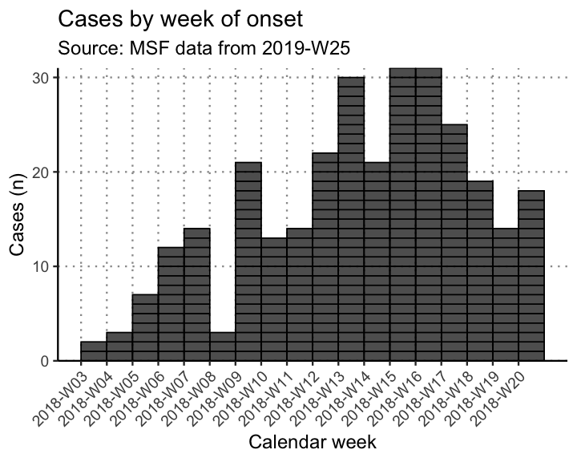<!-- -->

The peak of the outbreak was in 2018-W15.


<!-- ~~~~~~~~~~~~~~~~~~~~~~~~~~~~~~~~~~~~~~~~~~~~~~~~~~~~~~~~~~~~~~~~~~~~~~~~~~~
/// biweekly_epicurve \\\
--------------------------------------------------------------------------------

If needed, you can plot a biweekly epicurve. You can also do this by month,
quarter, or year. You can change the start of your week as needed.
~~~~~~~~~~~~~~~~~~~~~~~~~~~~~~~~~~~~~~~~~~~~~~~~~~~~~~~~~~~~~~~~~~~~~~~~~~~~ -->


```
## Warning: It is deprecated to specify `guide = FALSE` to remove a guide. Please
## use `guide = "none"` instead.
```

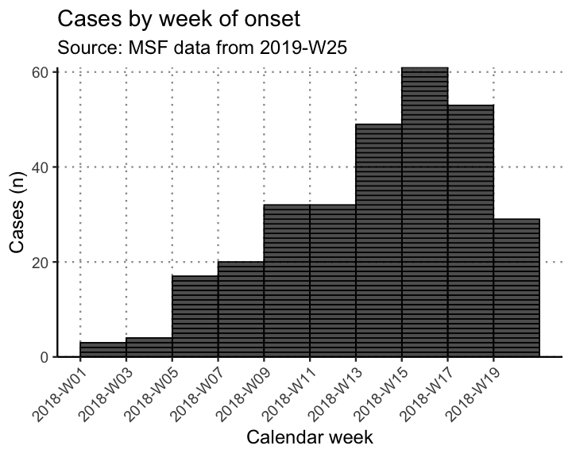<!-- -->


<!-- ~~~~~~~~~~~~~~~~~~~~~~~~~~~~~~~~~~~~~~~~~~~~~~~~~~~~~~~~~~~~~~~~~~~~~~~~~~~
/// incidence_by_gender \\\
--------------------------------------------------------------------------------

You can plot weekly incidence by gender using this chunk.
~~~~~~~~~~~~~~~~~~~~~~~~~~~~~~~~~~~~~~~~~~~~~~~~~~~~~~~~~~~~~~~~~~~~~~~~~~~~ -->

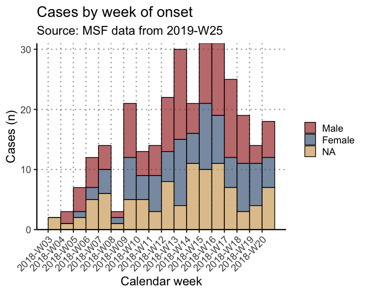<!-- -->


<!-- ~~~~~~~~~~~~~~~~~~~~~~~~~~~~~~~~~~~~~~~~~~~~~~~~~~~~~~~~~~~~~~~~~~~~~~~~~~~
/// incidence_by_case_def \\\
--------------------------------------------------------------------------------

This chunk shows the weekly incidence by case definition. You must have a
defined case definition variable.
~~~~~~~~~~~~~~~~~~~~~~~~~~~~~~~~~~~~~~~~~~~~~~~~~~~~~~~~~~~~~~~~~~~~~~~~~~~~ -->
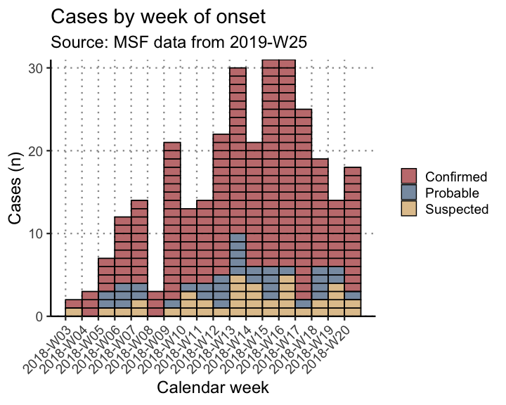<!-- -->


<!-- ~~~~~~~~~~~~~~~~~~~~~~~~~~~~~~~~~~~~~~~~~~~~~~~~~~~~~~~~~~~~~~~~~~~~~~~~~~~
/// incidence_by_sex_facility \\\
--------------------------------------------------------------------------------

This chunk limits the data to only inpatients, then stratifies by sex.
~~~~~~~~~~~~~~~~~~~~~~~~~~~~~~~~~~~~~~~~~~~~~~~~~~~~~~~~~~~~~~~~~~~~~~~~~~~~ -->
Cases by week of onset among inpatients by sex 
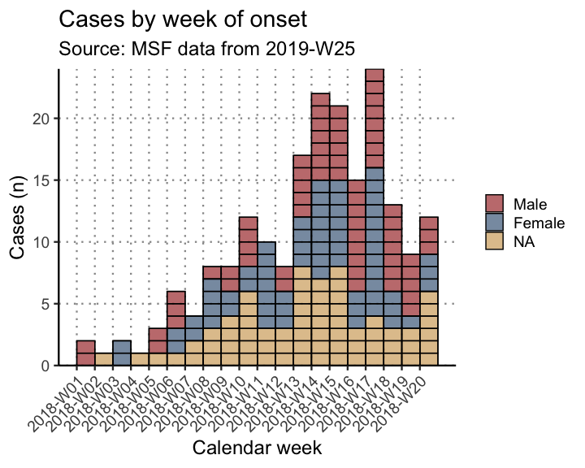<!-- -->


<!-- ~~~~~~~~~~~~~~~~~~~~~~~~~~~~~~~~~~~~~~~~~~~~~~~~~~~~~~~~~~~~~~~~~~~~~~~~~~~
/// attack_rate_per_week \\\
--------------------------------------------------------------------------------

This chunk creates a table of attack rate by week
~~~~~~~~~~~~~~~~~~~~~~~~~~~~~~~~~~~~~~~~~~~~~~~~~~~~~~~~~~~~~~~~~~~~~~~~~~~~ -->
Attack rate per 10,000 population by week 


|  Epiweek| Cases (n)| Population| AR (per 10,000)|          95%CI|
|--------:|---------:|----------:|---------------:|--------------:|
| 2018-W01|         2|     4999.5|               4|  (1.10--14.58)|
| 2018-W02|         1|     4999.5|               2|  (0.35--11.32)|
| 2018-W03|         2|     4999.5|               4|  (1.10--14.58)|
| 2018-W04|         2|     4999.5|               4|  (1.10--14.58)|
| 2018-W05|         7|     4999.5|              14|  (6.78--28.88)|
| 2018-W06|        10|     4999.5|              20| (10.87--36.78)|
| 2018-W07|         6|     4999.5|              12|  (5.50--26.16)|
| 2018-W08|        14|     4999.5|              28| (16.69--46.95)|
| 2018-W09|        13|     4999.5|              26| (15.20--44.44)|
| 2018-W10|        19|     4999.5|              38| (24.34--59.28)|
| 2018-W11|        16|     4999.5|              32| (19.71--51.93)|
| 2018-W12|        16|     4999.5|              32| (19.71--51.93)|
| 2018-W13|        21|     4999.5|              42| (27.49--64.13)|
| 2018-W14|        28|     4999.5|              56| (38.78--80.83)|
| 2018-W15|        36|     4999.5|              72| (52.06--99.52)|
| 2018-W16|        25|     4999.5|              50| (33.89--73.72)|
| 2018-W17|        36|     4999.5|              72| (52.06--99.52)|
| 2018-W18|        17|     4999.5|              34| (21.24--54.39)|
| 2018-W19|        11|     4999.5|              22| (12.29--39.36)|
| 2018-W20|        18|     4999.5|              36| (22.79--56.84)|
 


<!-- ~~~~~~~~~~~~~~~~~~~~~~~~~~~~~~~~~~~~~~~~~~~~~~~~~~~~~~~~~~~~~~~~~~~~~~~~~~~
/// cumulative_attack_rate_per_week \\\
--------------------------------------------------------------------------------

This chunk calculates the cumulative attack rate per week.
~~~~~~~~~~~~~~~~~~~~~~~~~~~~~~~~~~~~~~~~~~~~~~~~~~~~~~~~~~~~~~~~~~~~~~~~~~~~ -->
Cumulative attack rate per 10,000 population per week


|  Epiweek| Cases (n)| Population| AR (per 10,000)|            95%CI|
|--------:|---------:|----------:|---------------:|----------------:|
| 2018-W01|         2|     4999.5|             4.0|    (1.10--14.58)|
| 2018-W02|         3|     4999.5|             6.0|    (2.04--17.63)|
| 2018-W03|         5|     4999.5|            10.0|    (4.27--23.39)|
| 2018-W04|         7|     4999.5|            14.0|    (6.78--28.88)|
| 2018-W05|        14|     4999.5|            28.0|   (16.69--46.95)|
| 2018-W06|        24|     4999.5|            48.0|   (32.28--71.33)|
| 2018-W07|        30|     4999.5|            60.0|   (42.07--85.53)|
| 2018-W08|        44|     4999.5|            88.0|  (65.63--117.93)|
| 2018-W09|        57|     4999.5|           114.0|  (88.11--147.42)|
| 2018-W10|        76|     4999.5|           152.0| (121.63--189.84)|
| 2018-W11|        92|     4999.5|           184.0| (150.29--225.14)|
| 2018-W12|       108|     4999.5|           216.0| (179.24--260.14)|
| 2018-W13|       129|     4999.5|           258.0| (217.58--305.75)|
| 2018-W14|       157|     4999.5|           314.0| (269.17--366.09)|
| 2018-W15|       193|     4999.5|           386.0| (336.08--443.08)|
| 2018-W16|       218|     4999.5|           436.0| (382.85--496.24)|
| 2018-W17|       254|     4999.5|           508.1| (450.55--572.45)|
| 2018-W18|       271|     4999.5|           542.1| (482.64--608.31)|
| 2018-W19|       282|     4999.5|           564.1| (503.45--631.48)|
| 2018-W20|       300|     4999.5|           600.1| (537.54--669.33)|


<!-- ~~~~~~~~~~~~~~~~~~~~~~~~~~~~~~~~~~~~~~~~~~~~~~~~~~~~~~~~~~~~~~~~~~~~~~~~~~~
/// cumulative_attack_rate_per_week \\\
--------------------------------------------------------------------------------

This chunk calculates the CFR among inpatients as a proportion per week.
~~~~~~~~~~~~~~~~~~~~~~~~~~~~~~~~~~~~~~~~~~~~~~~~~~~~~~~~~~~~~~~~~~~~~~~~~~~~ -->
Case fatality ratio as a proportion among inpatients by week


|  Epiweek| Deaths| Cases| CFR (%)|          95%CI|
|--------:|------:|-----:|-------:|--------------:|
| 2018-W01|      0|     2|     0.0|  (0.00--65.76)|
| 2018-W02|      0|     1|     0.0|  (0.00--79.35)|
| 2018-W03|      1|     2|    50.0|  (9.45--90.55)|
| 2018-W04|      0|     1|     0.0|  (0.00--79.35)|
| 2018-W05|      0|     3|     0.0|  (0.00--56.15)|
| 2018-W06|      1|     6|    16.7|  (3.01--56.35)|
| 2018-W07|      2|     4|    50.0| (15.00--85.00)|
| 2018-W08|      2|     8|    25.0|  (7.15--59.07)|
| 2018-W09|      4|     8|    50.0| (21.52--78.48)|
| 2018-W10|      5|    12|    41.7| (19.33--68.05)|
| 2018-W11|      4|    10|    40.0| (16.82--68.73)|
| 2018-W12|      2|     8|    25.0|  (7.15--59.07)|
| 2018-W13|      5|    17|    29.4| (13.28--53.13)|
| 2018-W14|      5|    22|    22.7| (10.12--43.44)|
| 2018-W15|      3|    21|    14.3|  (4.98--34.64)|
| 2018-W16|      5|    15|    33.3| (15.18--58.29)|
| 2018-W17|      6|    24|    25.0| (12.00--44.90)|
| 2018-W18|      4|    13|    30.8| (12.68--57.63)|
| 2018-W19|      3|     9|    33.3| (12.06--64.58)|
| 2018-W20|      4|    12|    33.3| (13.81--60.94)|


<!-- ~~~~~~~~~~~~~~~~~~~~~~~~~~~~~~~~~~~~~~~~~~~~~~~~~~~~~~~~~~~~~~~~~~~~~~~~~~~
You could plot the AR (in the population) and CFR (among inpatients only)
together with the epicurve by epiweek.

We will do this in three steps: 
- creating the AR graph (ar_line_graph)
- creating the CFR graph (cfr_line_graph)
- combining and plotting (epicurve_ar_cfr)
~~~~~~~~~~~~~~~~~~~~~~~~~~~~~~~~~~~~~~~~~~~~~~~~~~~~~~~~~~~~~~~~~~~~~~~~~~~~ -->


<!-- ~~~~~~~~~~~~~~~~~~~~~~~~~~~~~~~~~~~~~~~~~~~~~~~~~~~~~~~~~~~~~~~~~~~~~~~~~~~
/// ar_line_graph \\\
--------------------------------------------------------------------------------

This chunk sets up the AR graph. (It does not print the graph automatically.)
~~~~~~~~~~~~~~~~~~~~~~~~~~~~~~~~~~~~~~~~~~~~~~~~~~~~~~~~~~~~~~~~~~~~~~~~~~~~ -->


<!-- ~~~~~~~~~~~~~~~~~~~~~~~~~~~~~~~~~~~~~~~~~~~~~~~~~~~~~~~~~~~~~~~~~~~~~~~~~~~
/// cfr_line_graph \\\
--------------------------------------------------------------------------------

This chunk sets up the CFR graph. (It does not print the graph automatically.)
If you do not have any deaths in your data set, this will not show anything.
~~~~~~~~~~~~~~~~~~~~~~~~~~~~~~~~~~~~~~~~~~~~~~~~~~~~~~~~~~~~~~~~~~~~~~~~~~~~ -->


<!-- ~~~~~~~~~~~~~~~~~~~~~~~~~~~~~~~~~~~~~~~~~~~~~~~~~~~~~~~~~~~~~~~~~~~~~~~~~~~
/// epicurve_ar_cfr \\\
--------------------------------------------------------------------------------

This chunk prints the AR and CFR with the epicurve.
~~~~~~~~~~~~~~~~~~~~~~~~~~~~~~~~~~~~~~~~~~~~~~~~~~~~~~~~~~~~~~~~~~~~~~~~~~~~ -->
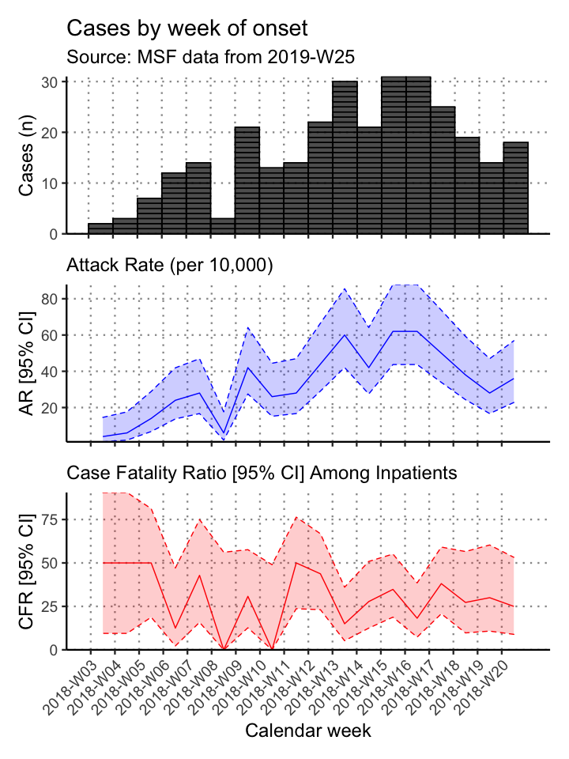<!-- -->


<!-- ~~~~~~~~~~~~~~~~~~~~~~~~~~~~~~~~~~~~~~~~~~~~~~~~~~~~~~~~~~~~~~~~~~~~~~~~~~~
/// describe_admissions_by_epiweek \\\
--------------------------------------------------------------------------------

This chunk creates a table showing inpatient admissions by epiweek.
~~~~~~~~~~~~~~~~~~~~~~~~~~~~~~~~~~~~~~~~~~~~~~~~~~~~~~~~~~~~~~~~~~~~~~~~~~~~ -->
Inpatient admissions by case definition and week  


|value    | Confirmed (n)|     %| Probable (n)|     %| Suspected (n)|     %| Total|
|:--------|-------------:|-----:|------------:|-----:|-------------:|-----:|-----:|
|2018-W01 |             2|   1.4|            0|   0.0|             0|   0.0|     2|
|2018-W02 |             1|   0.7|            0|   0.0|             0|   0.0|     1|
|2018-W03 |             2|   1.4|            0|   0.0|             0|   0.0|     2|
|2018-W04 |             1|   0.7|            0|   0.0|             0|   0.0|     1|
|2018-W05 |             2|   1.4|            0|   0.0|             1|   3.1|     3|
|2018-W06 |             4|   2.9|            1|   3.8|             1|   3.1|     6|
|2018-W07 |             3|   2.1|            1|   3.8|             0|   0.0|     4|
|2018-W08 |             5|   3.6|            1|   3.8|             2|   6.2|     8|
|2018-W09 |             5|   3.6|            2|   7.7|             1|   3.1|     8|
|2018-W10 |            10|   7.1|            0|   0.0|             2|   6.2|    12|
|2018-W11 |             6|   4.3|            2|   7.7|             2|   6.2|    10|
|2018-W12 |             6|   4.3|            2|   7.7|             0|   0.0|     8|
|2018-W13 |            13|   9.3|            2|   7.7|             2|   6.2|    17|
|2018-W14 |            15|  10.7|            3|  11.5|             4|  12.5|    22|
|2018-W15 |            12|   8.6|            4|  15.4|             5|  15.6|    21|
|2018-W16 |            10|   7.1|            2|   7.7|             3|   9.4|    15|
|2018-W17 |            19|  13.6|            1|   3.8|             4|  12.5|    24|
|2018-W18 |            10|   7.1|            1|   3.8|             2|   6.2|    13|
|2018-W19 |             4|   2.9|            3|  11.5|             2|   6.2|     9|
|2018-W20 |            10|   7.1|            1|   3.8|             1|   3.1|    12|
|Total    |           140| 100.0|           26| 100.0|            32| 100.0|   198|


<!-- ~~~~~~~~~~~~~~~~~~~~~~~~~~~~~~~~~~~~~~~~~~~~~~~~~~~~~~~~~~~~~~~~~~~~~~~~~~~
/// describe_admissions_by_epiweek \\\
--------------------------------------------------------------------------------

This chunk creates a table showing inpatient exits by type per epiweek.
~~~~~~~~~~~~~~~~~~~~~~~~~~~~~~~~~~~~~~~~~~~~~~~~~~~~~~~~~~~~~~~~~~~~~~~~~~~~ -->
Inpatient discharges by reason for exit and week 


|Week     | Died (n)|     %| Discharged (n)|     %| Left (n)|     %| Transferred (n)|     %| Total|
|:--------|--------:|-----:|--------------:|-----:|--------:|-----:|---------------:|-----:|-----:|
|2018-W01 |        0|   0.0|              0|   0.0|        0|   0.0|               2|   2.6|     2|
|2018-W02 |        0|   0.0|              0|   0.0|        1|   2.4|               0|   0.0|     1|
|2018-W03 |        1|   1.8|              0|   0.0|        0|   0.0|               1|   1.3|     2|
|2018-W04 |        0|   0.0|              0|   0.0|        0|   0.0|               1|   1.3|     1|
|2018-W05 |        0|   0.0|              1|   4.3|        0|   0.0|               2|   2.6|     3|
|2018-W06 |        1|   1.8|              3|  13.0|        0|   0.0|               2|   2.6|     6|
|2018-W07 |        2|   3.6|              0|   0.0|        0|   0.0|               2|   2.6|     4|
|2018-W08 |        2|   3.6|              0|   0.0|        3|   7.3|               3|   3.8|     8|
|2018-W09 |        4|   7.1|              1|   4.3|        2|   4.9|               1|   1.3|     8|
|2018-W10 |        5|   8.9|              0|   0.0|        3|   7.3|               4|   5.1|    12|
|2018-W11 |        4|   7.1|              2|   8.7|        2|   4.9|               2|   2.6|    10|
|2018-W12 |        2|   3.6|              0|   0.0|        1|   2.4|               5|   6.4|     8|
|2018-W13 |        5|   8.9|              2|   8.7|        4|   9.8|               6|   7.7|    17|
|2018-W14 |        5|   8.9|              1|   4.3|        4|   9.8|              12|  15.4|    22|
|2018-W15 |        3|   5.4|              4|  17.4|        3|   7.3|              11|  14.1|    21|
|2018-W16 |        5|   8.9|              3|  13.0|        3|   7.3|               4|   5.1|    15|
|2018-W17 |        6|  10.7|              3|  13.0|        7|  17.1|               8|  10.3|    24|
|2018-W18 |        4|   7.1|              1|   4.3|        5|  12.2|               3|   3.8|    13|
|2018-W19 |        3|   5.4|              2|   8.7|        1|   2.4|               3|   3.8|     9|
|2018-W20 |        4|   7.1|              0|   0.0|        2|   4.9|               6|   7.7|    12|
|Total    |       56| 100.0|             23| 100.0|       41| 100.0|              78| 100.0|   198|


### Place 
<!-- ~~~~~~~~~~~~~~~~~~~~~~~~~~~~~~~~~~~~~~~~~~~~~~~~~~~~~~~~~~~~~~~~~~~~~~~~~~~
This section focuses on the where of the outbreak: what area is affected, how
many villages, and so on.

There is code to include maps based on distribution of cases. You must have a
shapefile to create this map.
~~~~~~~~~~~~~~~~~~~~~~~~~~~~~~~~~~~~~~~~~~~~~~~~~~~~~~~~~~~~~~~~~~~~~~~~~~~~ -->


#### Descriptive


<!-- ~~~~~~~~~~~~~~~~~~~~~~~~~~~~~~~~~~~~~~~~~~~~~~~~~~~~~~~~~~~~~~~~~~~~~~~~~~~
/// describe_by_region_facility \\\
--------------------------------------------------------------------------------

This chunk creates a basic table of the number and percent of cases by region
and by facility. If you only have one facility, you can remove the strata.
~~~~~~~~~~~~~~~~~~~~~~~~~~~~~~~~~~~~~~~~~~~~~~~~~~~~~~~~~~~~~~~~~~~~~~~~~~~~ -->
Cases by region and facility type


|Region    | Inpatient (n)|     %| Outpatient (n)|     %| Total|
|:---------|-------------:|-----:|--------------:|-----:|-----:|
|Village A |            56|  28.3|             37|  36.3|    93|
|Village B |            48|  24.2|             18|  17.6|    66|
|Village C |            54|  27.3|             29|  28.4|    83|
|Village D |            40|  20.2|             18|  17.6|    58|
|Total     |           198| 100.0|            102| 100.0|   300|


<!-- ~~~~~~~~~~~~~~~~~~~~~~~~~~~~~~~~~~~~~~~~~~~~~~~~~~~~~~~~~~~~~~~~~~~~~~~~~~~
/// describe_by_region_outcome \\\
--------------------------------------------------------------------------------

This chunk creates a basic table of the outcomes among inpatients by region.
~~~~~~~~~~~~~~~~~~~~~~~~~~~~~~~~~~~~~~~~~~~~~~~~~~~~~~~~~~~~~~~~~~~~~~~~~~~~ -->
Inpatient discharges by reason for exit and region 


|Region    | Died (n)|     %| Discharged (n)|     %| Left (n)|     %| Transferred (n)|     %| Total|
|:---------|--------:|-----:|--------------:|-----:|--------:|-----:|---------------:|-----:|-----:|
|Village A |       16|  28.6|             11|  47.8|        7|  17.1|              22|  28.2|    56|
|Village B |       10|  17.9|              7|  30.4|       15|  36.6|              16|  20.5|    48|
|Village C |       20|  35.7|              3|  13.0|       11|  26.8|              20|  25.6|    54|
|Village D |       10|  17.9|              2|   8.7|        8|  19.5|              20|  25.6|    40|
|Total     |       56| 100.0|             23| 100.0|       41| 100.0|              78| 100.0|   198|


<!-- ~~~~~~~~~~~~~~~~~~~~~~~~~~~~~~~~~~~~~~~~~~~~~~~~~~~~~~~~~~~~~~~~~~~~~~~~~~~
/// attack_rate_by_region \\\
--------------------------------------------------------------------------------

If you do not have a shapefile, you may want to calculate attack rates by
region.

Consider facet wrapping by a larger unit if you have many regions (eg if you
have patients from 10+ villages, you may want to show your tables by health
zone)
~~~~~~~~~~~~~~~~~~~~~~~~~~~~~~~~~~~~~~~~~~~~~~~~~~~~~~~~~~~~~~~~~~~~~~~~~~~~ -->
Attack rage per 10,000 population by region 


|    Region| Cases (n)| Population| AR (per 10,000)|             95%CI|
|---------:|---------:|----------:|---------------:|-----------------:|
| Village A|        93|      1,105|           841.6| (691.99--1020.08)|
| Village B|        66|        870|           758.6|  (600.72--953.81)|
| Village C|        83|      1,775|           467.6|  (378.79--575.99)|
| Village D|        58|      1,225|           473.5|  (368.04--607.20)|


<!-- ~~~~~~~~~~~~~~~~~~~~~~~~~~~~~~~~~~~~~~~~~~~~~~~~~~~~~~~~~~~~~~~~~~~~~~~~~~~
/// bar_attack_rate_by_region \\\
--------------------------------------------------------------------------------

You can then plot the above table on a bar plot. AR is on the y-axis, and it
will show regions in descending order by AR.
~~~~~~~~~~~~~~~~~~~~~~~~~~~~~~~~~~~~~~~~~~~~~~~~~~~~~~~~~~~~~~~~~~~~~~~~~~~~ -->
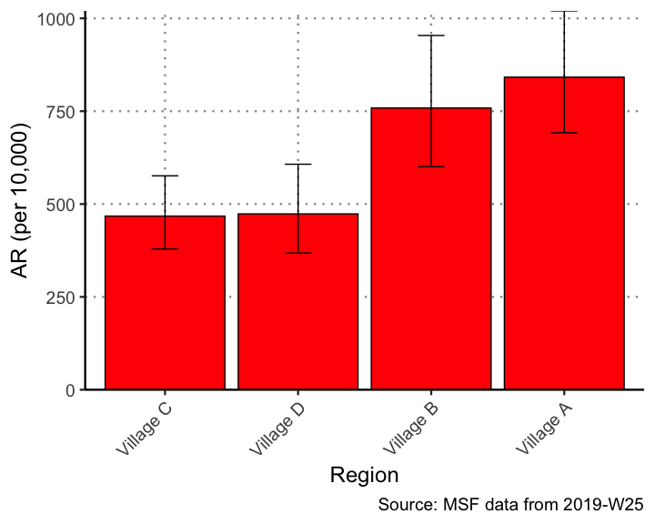<!-- -->


<!-- ~~~~~~~~~~~~~~~~~~~~~~~~~~~~~~~~~~~~~~~~~~~~~~~~~~~~~~~~~~~~~~~~~~~~~~~~~~~
/// mortality_rate_region \\\
--------------------------------------------------------------------------------

You could also calculate mortality rate by region (check the mortality code
chunk in Person section for assumptions).
~~~~~~~~~~~~~~~~~~~~~~~~~~~~~~~~~~~~~~~~~~~~~~~~~~~~~~~~~~~~~~~~~~~~~~~~~~~~ -->
Mortality rate per 10,000 population by region 


|Region    | Deaths| Population| Mortality (per 10,000)|95%CI            |
|:---------|------:|----------:|----------------------:|:----------------|
|Village A |     26|       1105|                  235.3|(161.07--342.53) |
|Village B |     18|        870|                  206.9|(131.27--324.67) |
|Village C |     29|       1775|                  163.4|(113.99--233.66) |
|Village D |     14|       1225|                  114.3|(68.20--190.92)  |


#### Maps 
<!-- ~~~~~~~~~~~~~~~~~~~~~~~~~~~~~~~~~~~~~~~~~~~~~~~~~~~~~~~~~~~~~~~~~~~~~~~~~~~
/// read_shapefiles \\\
--------------------------------------------------------------------------------

To create maps, you need to have a shapefile of the area. Often, the MSF GIS
unit can provide shapefiles.

Your shapefile can be a polygon or points. Polygons do not need to be contiguous.

The names of the polygons or points MUST match the names in your linelist.

Your coordinate reference system needs to be WGS84.
~~~~~~~~~~~~~~~~~~~~~~~~~~~~~~~~~~~~~~~~~~~~~~~~~~~~~~~~~~~~~~~~~~~~~~~~~~~~ -->


<!-- ~~~~~~~~~~~~~~~~~~~~~~~~~~~~~~~~~~~~~~~~~~~~~~~~~~~~~~~~~~~~~~~~~~~~~~~~~~~
/// dot_map \\\
--------------------------------------------------------------------------------

If you have the coordinates for your cases, you can create a dot map showing
where the cases are.
~~~~~~~~~~~~~~~~~~~~~~~~~~~~~~~~~~~~~~~~~~~~~~~~~~~~~~~~~~~~~~~~~~~~~~~~~~~~ -->


<!-- ~~~~~~~~~~~~~~~~~~~~~~~~~~~~~~~~~~~~~~~~~~~~~~~~~~~~~~~~~~~~~~~~~~~~~~~~~~~
/// choropleth_maps \\\
--------------------------------------------------------------------------------

Once you have loaded your shapefile, you can map the case counts or attack rates.

You will want to make your counts or AR categorical. R will not do this
automatically (unlike QGIS or ArcGIS).

This chunk will walk you through several steps:
- Create table with categories of counts or ARs by region.
- Join your table with your shapefile.
- Choose which variable you will use.

Make sure you delete or comment out the section you are not using.
~~~~~~~~~~~~~~~~~~~~~~~~~~~~~~~~~~~~~~~~~~~~~~~~~~~~~~~~~~~~~~~~~~~~~~~~~~~~ -->
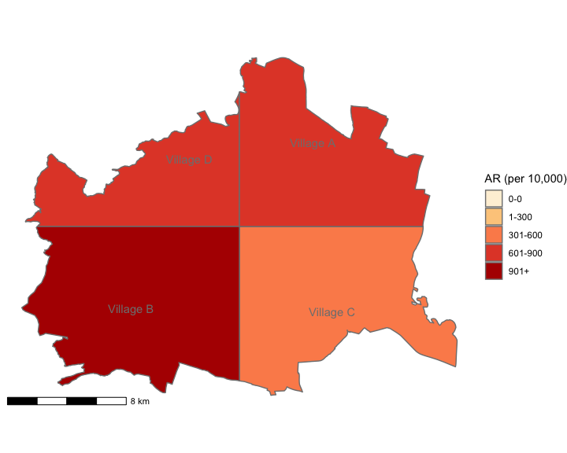<!-- -->


<!-- ~~~~~~~~~~~~~~~~~~~~~~~~~~~~~~~~~~~~~~~~~~~~~~~~~~~~~~~~~~~~~~~~~~~~~~~~~~~
/// map_for_loop_epiweek \\\
--------------------------------------------------------------------------------

This chunk will create a map and barplot by week.

You need to:
- Decide if you want to show counts, AR, or categories of counts/AR.
- Define categories for your variable.
- Replace `Cases (n)` and `AR (per 10,000)` or "categories", appropriately.


If you have a lot of map regions, you may want to use facet_wrap to show
sub-units.
~~~~~~~~~~~~~~~~~~~~~~~~~~~~~~~~~~~~~~~~~~~~~~~~~~~~~~~~~~~~~~~~~~~~~~~~~~~~ -->
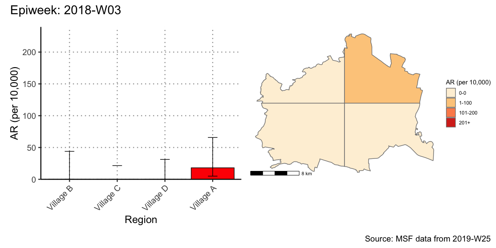<!-- -->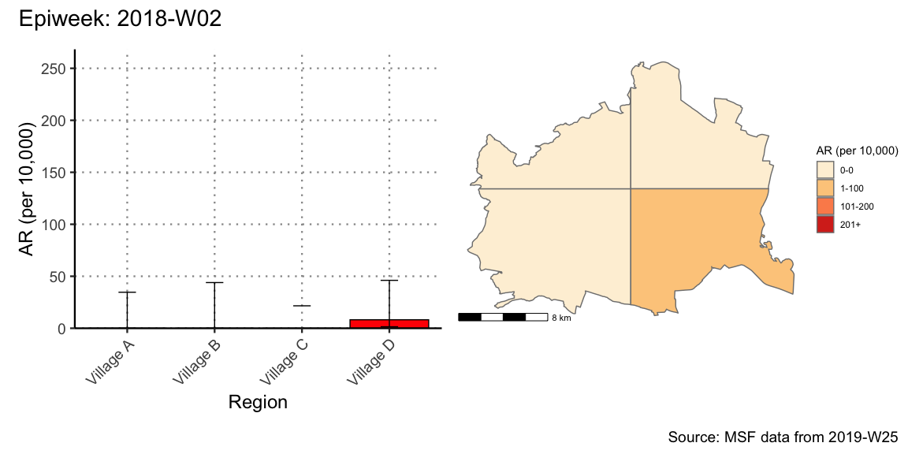<!-- -->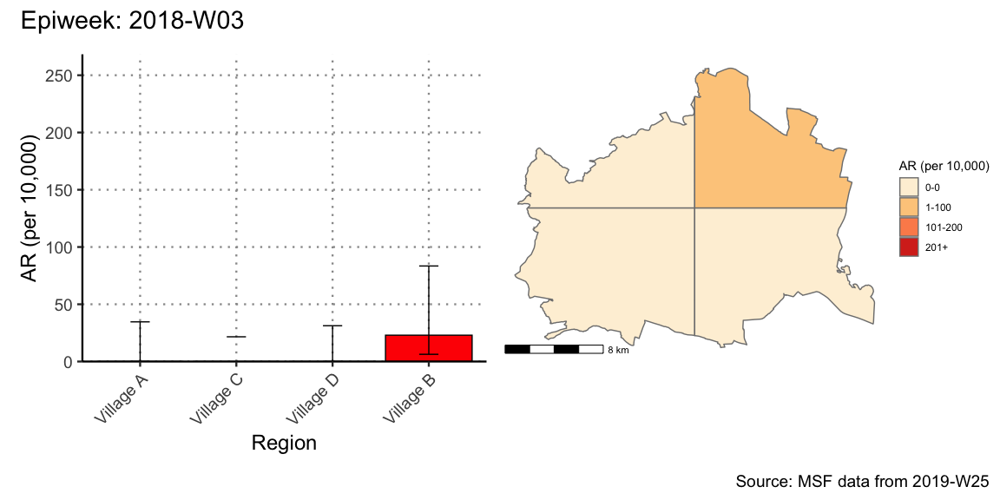<!-- -->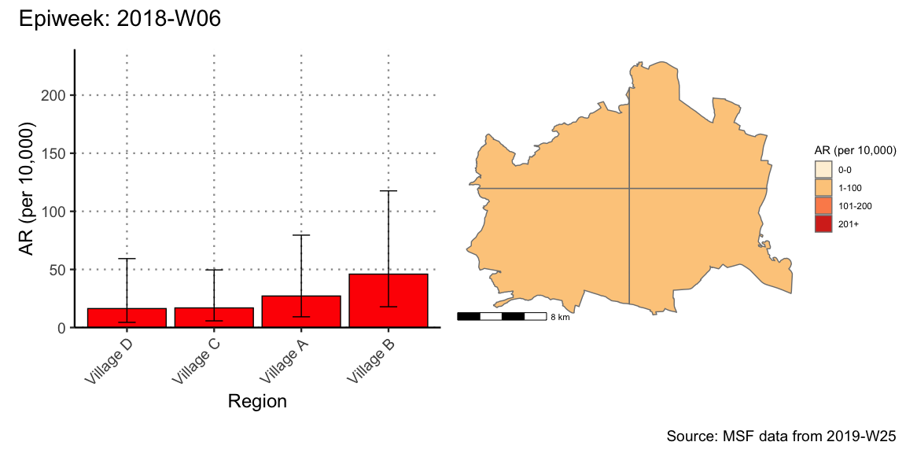<!-- -->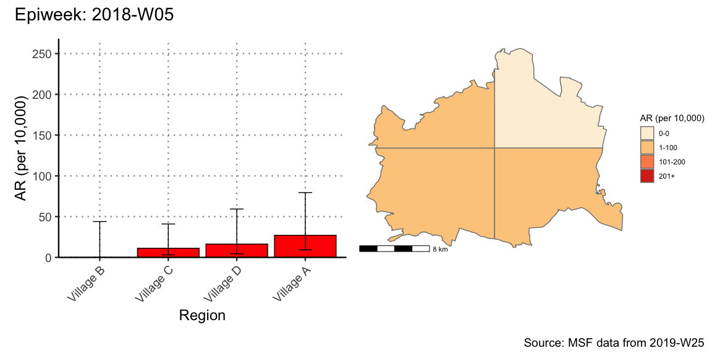<!-- -->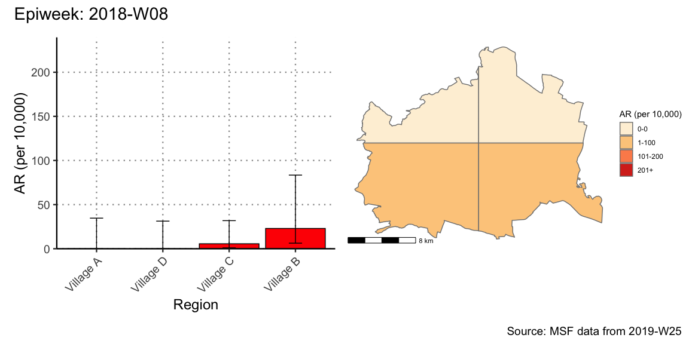<!-- --><!-- -->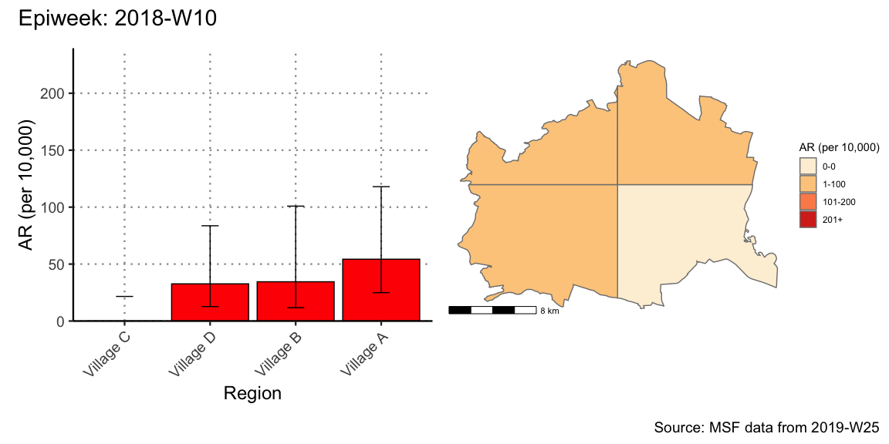<!-- -->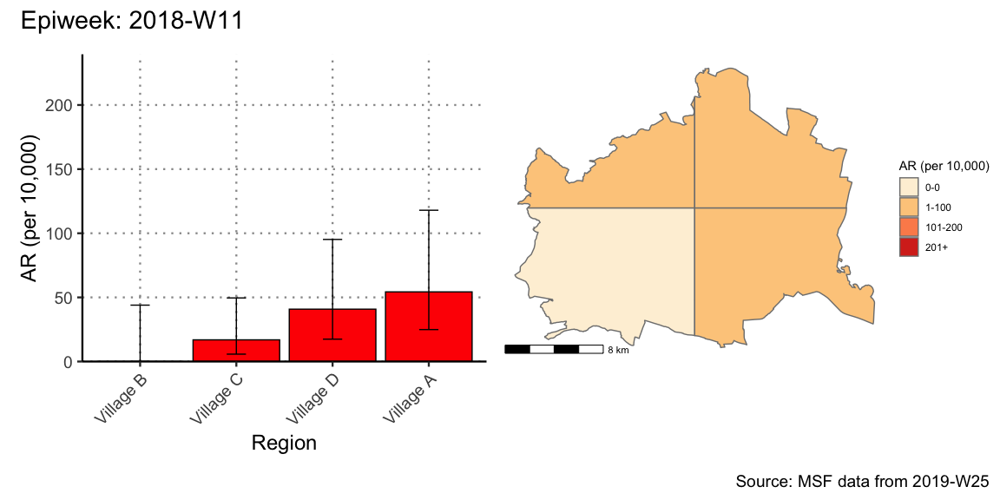<!-- -->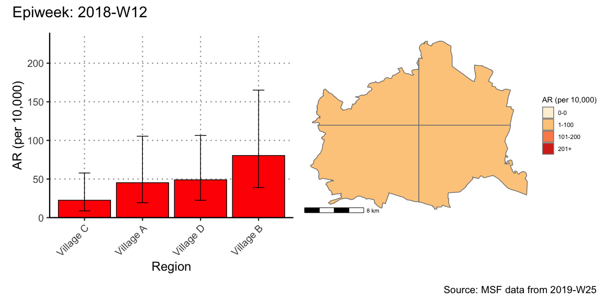<!-- -->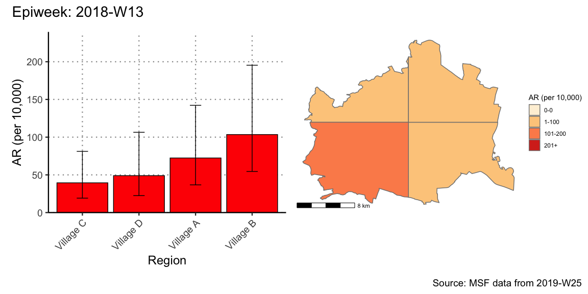<!-- -->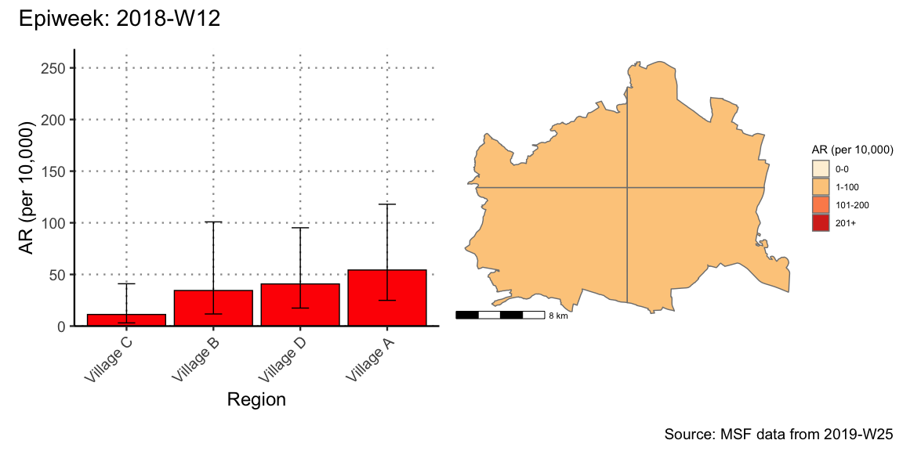<!-- -->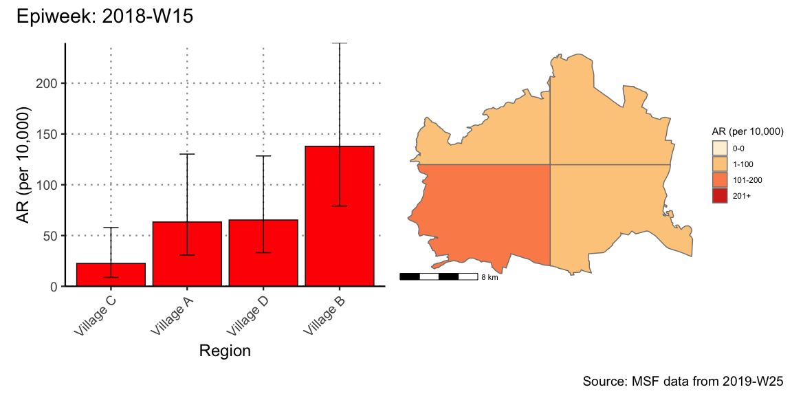<!-- -->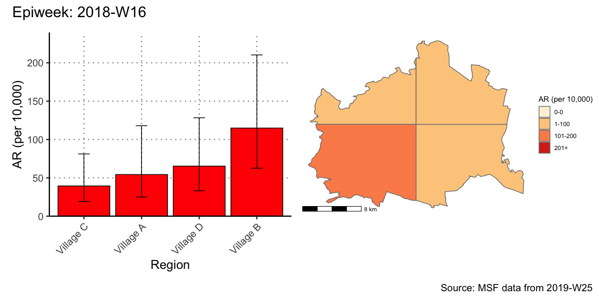<!-- -->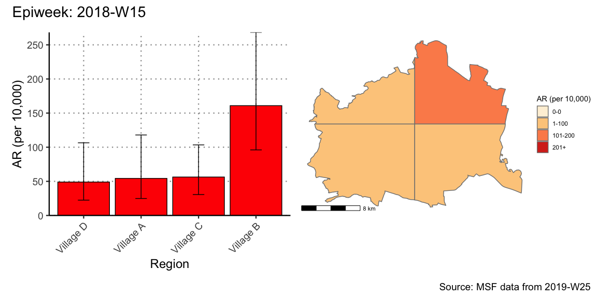<!-- -->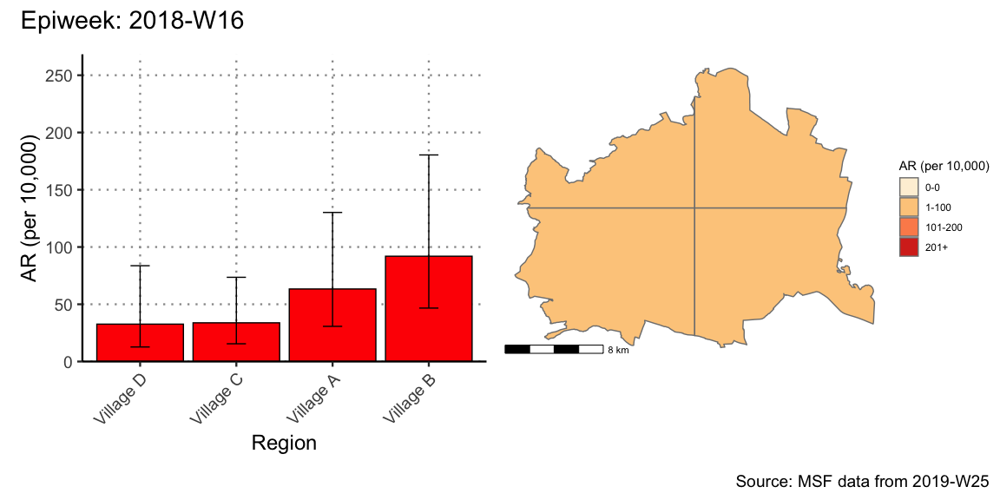<!-- --><!-- -->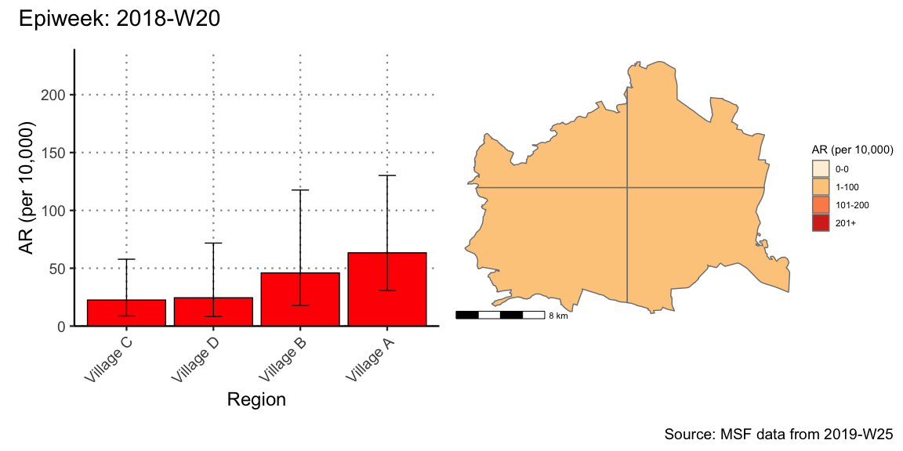<!-- -->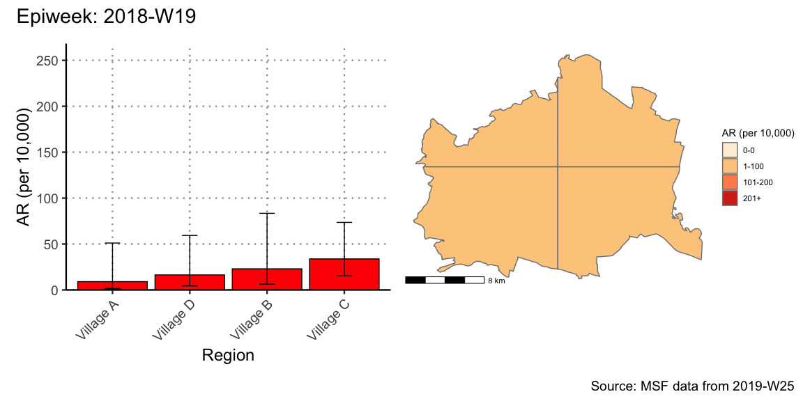<!-- -->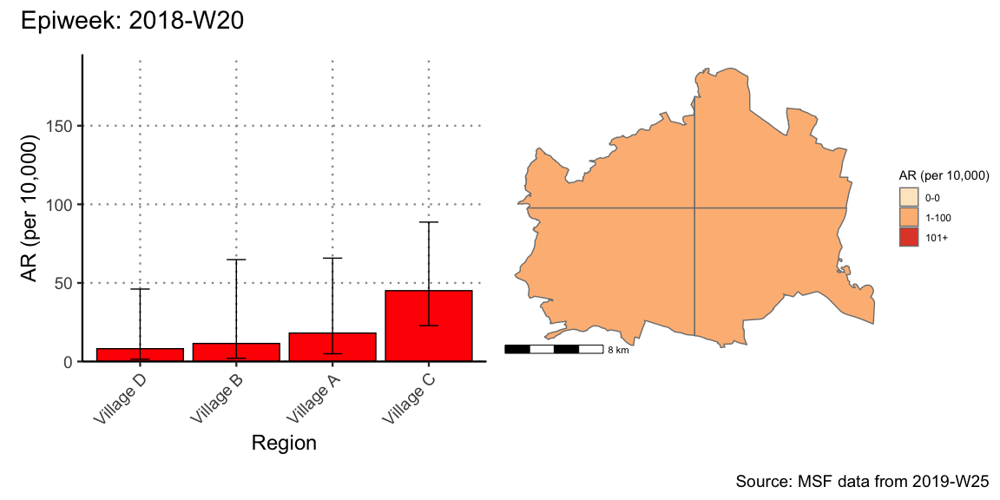<!-- -->

